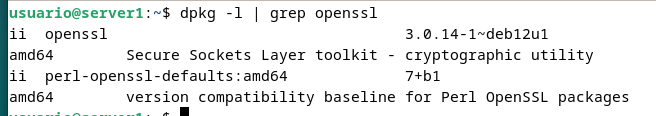
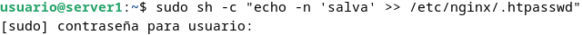
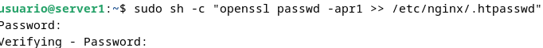
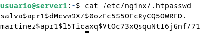
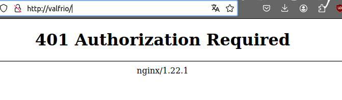
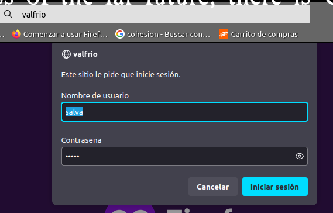
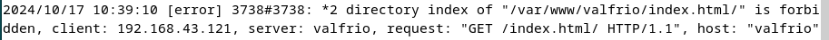
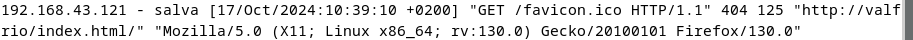
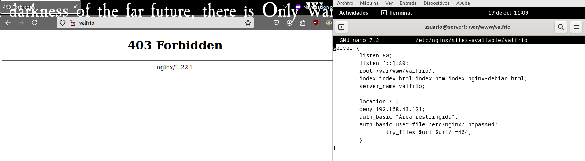

# Práctica 2.2

## 1. Introducción y paquetes necesarios
Para empezar debemos comprobar que tenemos OpenSSL instalado para poder cifrar las contraseñas. Para ello usamos el comando  dpkg  -l  |  grep  openssl



## 2. Creación de usuarios y contraseñas de acceso web

Ahora crearemos los dos usuarios con sus dos contraseñas. Para ello crearemos el archivo /etc/nginx/.htpasswd , donde ahora copiaremos en el archivo el usuario y las contraseñas. Para ello haré sudo  sh  -c  "echo -n 'Salva:' >> /etc/nginx/.htpasswd" y sudo  sh  -c  "openssl passwd -apr1 >> /etc/nginx/.htpasswd"







## 3. Configuración de Nginx para autentificación básica

Para la autentificación debemos primero de restringir el paso a todos los usuarios que no se identifiquen. Lo primero para hacer esto es añadir en el archivo de configuración de site-available las siguientes dos lineas a location

```
auth_basic  "Área restringida";
auth_basic_user_file  /etc/nginx/.htpasswd;
```

Después debemos de reiniciar el servicio para que los cambios se hagan efectivos. Después debemos de ver que cuando intentamos entrar con un usuario no nos permite entrar. 



Al intentar autentificarse de nuevo con un usuario que si es válido nso saldrá el menú como antes. Si hemos entrado ya con ese usuario guardará la contraseña.



Podemos ver en los registros que quedan registrados los dos accesos.

Acceso denegado:



Acceso permitido:



### Autentificación en contacto.html

## 4. Autentificación básica con restricción por acceso por IP

### 4.1 Denegar una IP
Para ello debemos de añadir en location deny ip, siendo ip la ip que quieres denegar. Yo le puse la ip de la maquina física y al intentar entrar, ni me pidió la contraseña:



### 4.2 Permitir IPs
### 4.3 Satisfy all

## 5. Cuestiones
### 5.1 Cuestión 1

*Supongamos que yo soy el cliente con la IP 172.1.10.15 e intento acceder al directorio web_muy_guay de mi sitio web, equivocándome al poner el usuario y contraseña. ¿Podré acceder?¿Por qué?*

No podrá acceder ya que el satisfy all le obliga a cumplir todos los requisitos, habiendo fallado la autentificacion

```

```
### 5.2 Cuestión 2

*ask "Cuestión 1" Supongamos que yo soy el cliente con la IP 172.1.10.15 e intento acceder al directorio web_muy_guay de mi sitio web, introduciendo correctamente usuario y contraseña. ¿Podré acceder?¿Por qué?*

Al contrario que en el caso anterior, cumple ambos requisitos por lo que podría acceder.
### 5.3 Cuestión 3

*Supongamos que yo soy el cliente con la IP 172.1.10.15 e intento acceder al directorio web_muy_guay de mi sitio web, introduciendo correctamente usuario y contraseña. ¿Podré acceder?¿Por qué?*

Podrá dado que el satisfy any obliga a cumplir 1 al menos, y nuestro usuario cumple la de las credenciales.

### 5.4 Cuestión 4

*A lo mejor no sabéis que tengo una web para documentar todas mis excursiones espaciales con Jeff, es esta: Jeff Bezos y yo*

*Supongamos que quiero restringir el acceso al directorio de proyectos porque es muy secreto, eso quiere decir añadir autenticación básica a la URL:Proyectos*

*Completa la configuración para conseguirlo:*

```
server {
    listen 80;
    listen [::]:80;
    root /var/www/freewebsitetemplates.com/preview/space-science;
    index index.html index.htm index.nginx-debian.html;
    server_name freewebsitetemplates.com www.freewebsitetemplates.com;

    location   /          {
        try_files $uri $uri/ =404;
    }

    location  /Proyectos/ {
        auth_basic "Restricted Area";
        auth_basic_user_file conf/htpasswd;

        try_files $uri $uri/ =404;
    }
}

```
